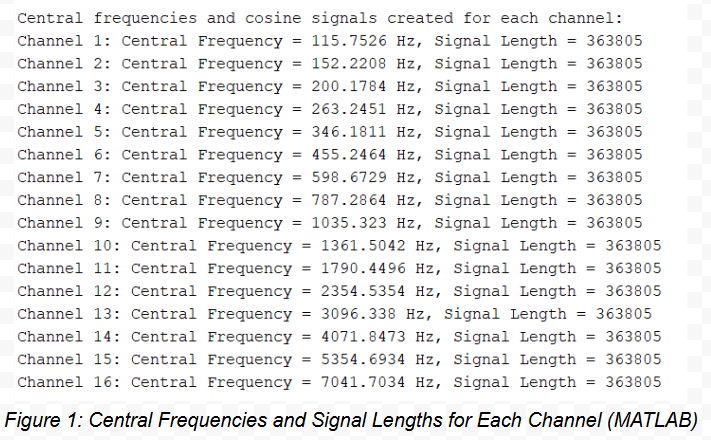
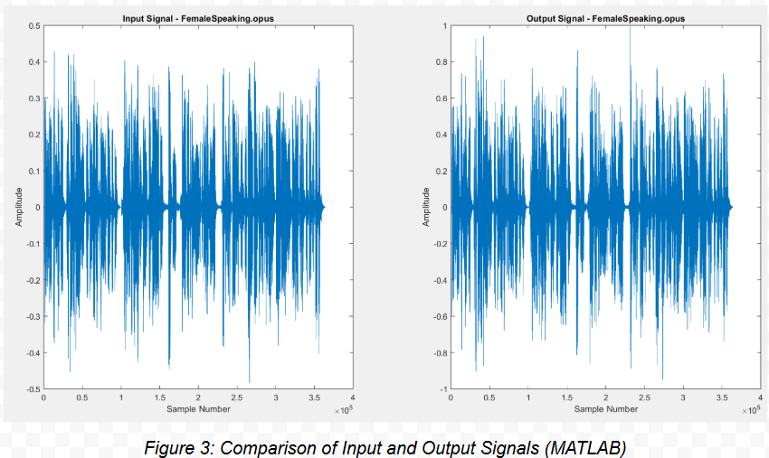

# Cochlear Implant DSP Simulator 
A MATLAB-based 22-channel audio processing pipeline that simulates cochlear implant functionality using bandpass filtering, envelope extraction, and amplitude modulation.

## Project Summary 
This project reconstructs speech and sound signals using a biologically inspired DSP model of a cochlear implant. Key steps include:

- Logarithmically spaced **Butterworth bandpass filters** (N = 16)
- **FIR envelope extraction** using custom sinc + Hamming filters
- **Amplitude modulation** with cosine carriers
- Signal **summation and normalization** for output reconstruction

## 📊 Results

| Metric                     | Value      |
|----------------------------|------------|
| RMS (Root Mean Square)     | 0.1405     |
| Latency                    | 56 ms      |

## Key Visuals
### Logarithmically Spaced Frequency Bands


### Amplitude Modulation


### Enveloped Signals


## 🛠 How It Works

```matlab```
% Read, downsample and preprocess audio
[audioData, fs] = audioread('input.wav');
audioData = resample(audioData, 16000, fs);

% Bandpass filtering across 16 channels
[b, a] = butter(4, [low, high]/(fs/2), 'bandpass');
filtered = filter(b, a, audioData);

% Envelope extraction and amplitude modulation
env = conv(abs(filtered), hamming(101), 'same');
modulated = env .* cos(2*pi*f*t);

## How To Run 
Clone this repo and install the Signal Processing Toolbox in Matlab
Load the audio files and set up the folder directory and file name in main
Add the src and audio_samples file to path for access
Run from the command line by calling main 


# Contributors
Zaki Sabir Shaikh
Aryan Jain
Emrehan Kilic 
Digvijay Mukherjee